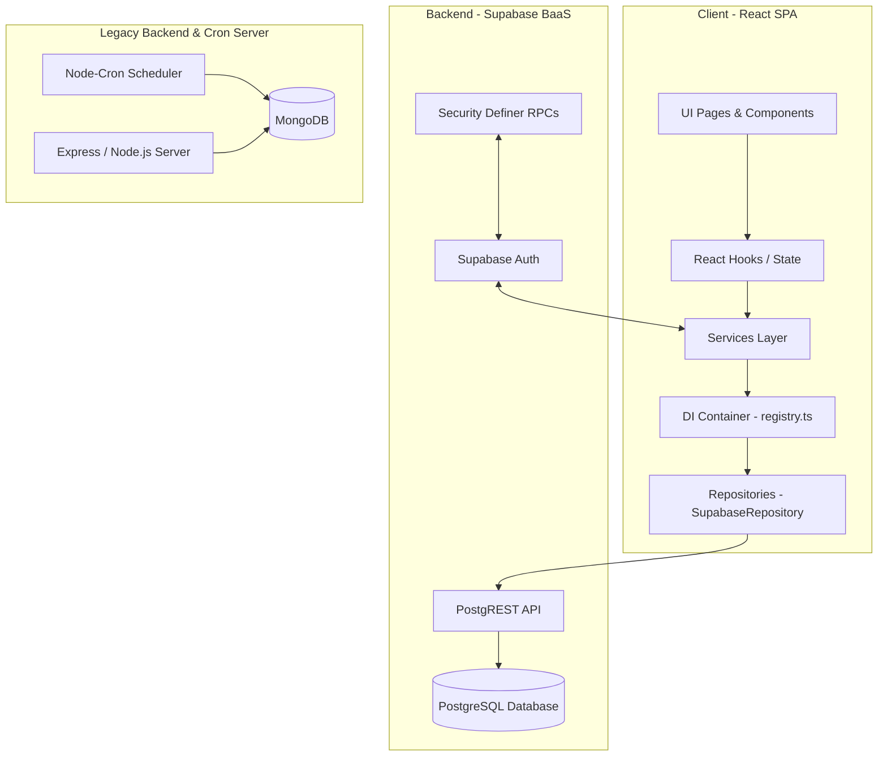
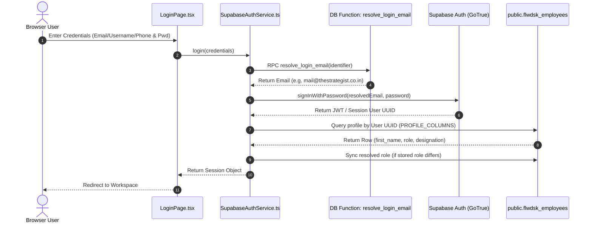
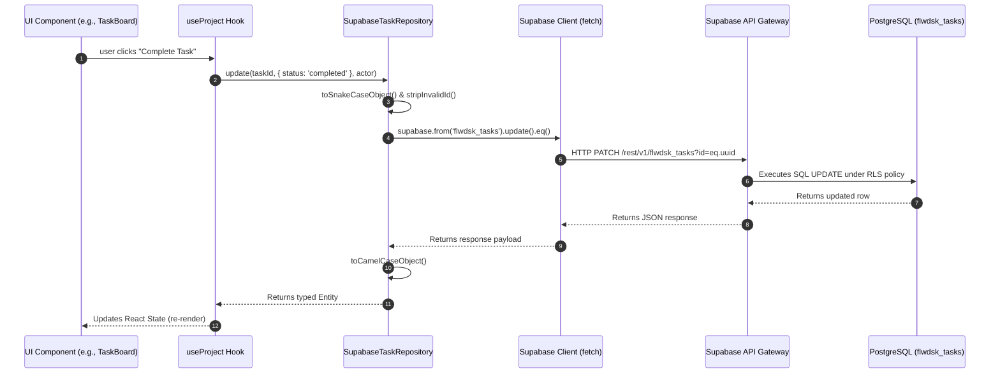

# Architecture Overview

This document provides a comprehensive analysis of the architectural layers, request flows, data access patterns, and component hierarchy of the KVJ Analytics application.

---

## 1. Application Layers

The application follows a decoupled client-server model, utilizing a React SPA for the frontend interface and Supabase (PostgreSQL + PostgREST) as the primary database-as-a-service backend. In addition, there is a Node.js Express server configured with MongoDB, which serves as a legacy runtime and executes scheduled cron jobs.



### Layer Breakdown

1. **Presentation Layer (React 19 & Vite 7)**:
   - Houses the UI components, style tokens (Tailwind CSS 4), and routing (`react-router-dom` 7).
   - Pages are lazy-loaded to optimize bundle size and load performance.
2. **State & Hook Layer (Context Providers)**:
   - Provides global states: `AuthProvider`, `WorkspaceProvider`, `ThemeProvider`, `NotificationProvider`, `DialogProvider`, `CommandPaletteProvider`.
   - Business modules utilize custom hooks (e.g., `useTraining`) to connect UI components to services.
3. **Service Layer (Core & Business Modules)**:
   - Implements business logic and orchestration (e.g., attendance correction workflows, leave skip-step logic).
   - Leverages a custom Dependency Injection (DI) registry (`src/core/registry.ts`) to resolve adapters.
4. **Repository Layer (Data Mapping & Persistence)**:
   - Base `SupabaseRepository` class handles standard CRUD queries, snake-case to camelCase mappings, and self-healing schema retries.
   - Specific repositories extend `SupabaseRepository` to perform custom joins and sub-table synchronizations.
5. **Database Layer (Supabase PostgreSQL)**:
   - Schema comprising 42 tables prefixed with `flwdsk_` (e.g., `flwdsk_employees`, `flwdsk_tasks`).
   - Gated by Row-Level Security (RLS) policies and security-definer helper functions.
6. **Legacy Background Layer (Node.js & MongoDB)**:
   - Express server located in `/server` running Scheduled Cron Jobs (clock-outs, leave balance resets).
   - Operates on a separate MongoDB instance.

---

## 2. System Request & Data Flows

### A. Authentication Flow
The application uses a custom credentials-matching sequence that resolves usernames, emails, or phone numbers to a primary Supabase Auth email before initiating authentication.



### B. Standard Database Request Flow
Data operations bypass intermediate custom API servers. The React application calls PostgREST directly through the Supabase client.



---

## 3. Component Hierarchy & Providers

The application's bootstrapping flow is orchestrated through a nested provider hierarchy in `src/main.tsx` and `src/app/AppProviders.tsx`.

```
<StrictMode>
  <BrowserRouter>
    <ThemeProvider>               <!-- Persists Light/Dark Mode & Custom Themes -->
      <WorkspaceProvider>         <!-- Manages Active Role-Based Workspaces -->
        <ConfigProvider>          <!-- Supplies App & Branding Configuration -->
          <AuthProvider>          <!-- Houses Active Session & User Profiles -->
            <NotificationProvider> <!-- Triggers Global Custom Toasts & Alerts -->
              <DialogProvider>    <!-- Controls Dynamic Confirmation Modals -->
                <CommandPaletteProvider> <!-- Captures Cmd+K Searches -->
                  <AppRouter>     <!-- Router Switch Boundary -->
                    <ErrorBoundary>
                      <Suspense fallback={<RouteLoading />}>
                        <Routes>
                          <Route path="/login" />
                          <Route path="/app" element={<ProtectedRoute>}>
                            <!-- Lazy-loaded Workspace / Module Pages -->
                          </Route>
                        </Routes>
                      </Suspense>
                    </ErrorBoundary>
                  </CommandPaletteProvider>
                </DialogProvider>
              </DialogProvider>
            </NotificationProvider>
          </AuthProvider>
        </ConfigProvider>
      </WorkspaceProvider>
    </ThemeProvider>
  </BrowserRouter>
</StrictMode>
```

---

## 4. Key Architectural Findings & Observations

1. **Hybrid Database State (MongoDB vs. PostgreSQL)**:
   - There is a complete duplication of modules in the Node.js Express project (`/server`) and the React project (`src`).
   - The React frontend is mapped purely to Supabase (PostgreSQL), while the Express server is mapped to MongoDB.
   - Background crons (e.g., auto-clock-out at 23:59) run only on the Express server and modify MongoDB. **Since the frontend writes to Supabase, these MongoDB cron jobs are ineffective on Supabase data, leaving clocked-in sessions orphaned on Supabase.**
2. **Direct Supabase Imports in Views**:
   - Although the project establishes a clean Repository and Service layer, multiple pages (e.g., `ExpenseClaims.tsx`, `TrainingCalendar.tsx`, `AnnouncementsBoard.tsx`) import `supabase` directly and execute queries in-place.
   - This bypasses the dependency injection container and defeats the purpose of the repository abstraction layer.
3. **Role Type Divergence**:
   - The React client defines 4 roles: `ADMIN`, `CEO`, `MANAGER`, and `EMPLOYEE`.
   - The database scripts (`reset-and-rebuild.sql`) define 6 roles: `ADMIN`, `CEO`, `MANAGER`, `COORDINATOR`, `TRAINER`, and `EMPLOYEE`.
   - Users with roles of `TRAINER` or `COORDINATOR` fall back to the default `EMPLOYEE` permission matrix in the React frontend, restricting their intended management features unless designated as `MANAGER` or `CEO` in the user profile.
