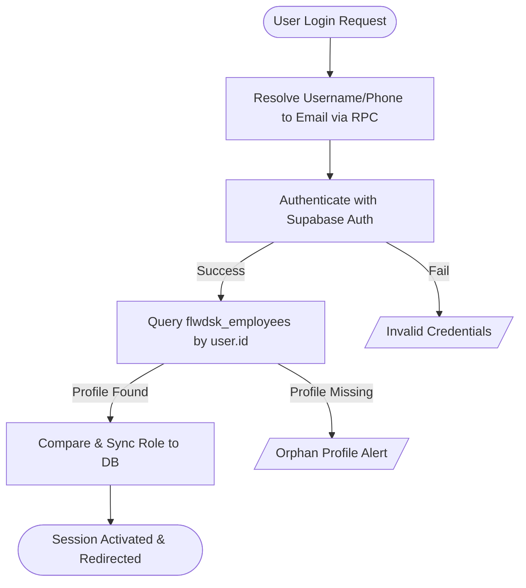
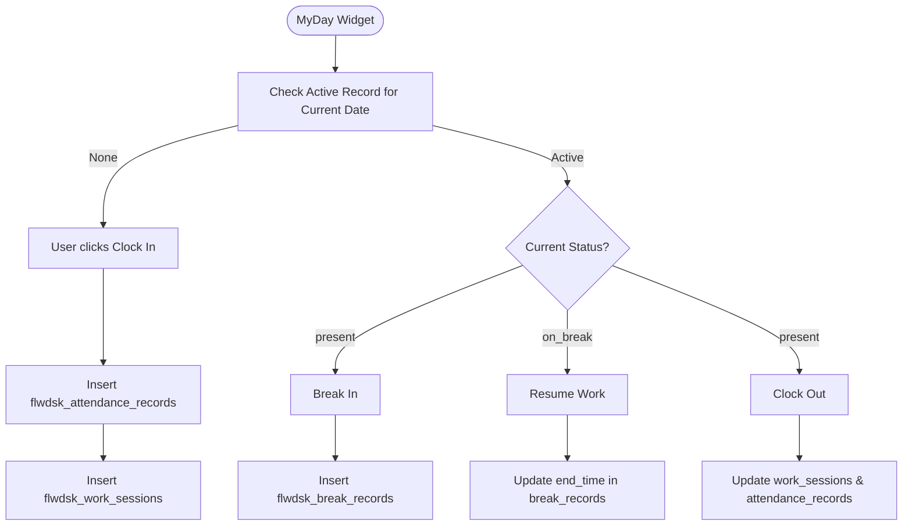
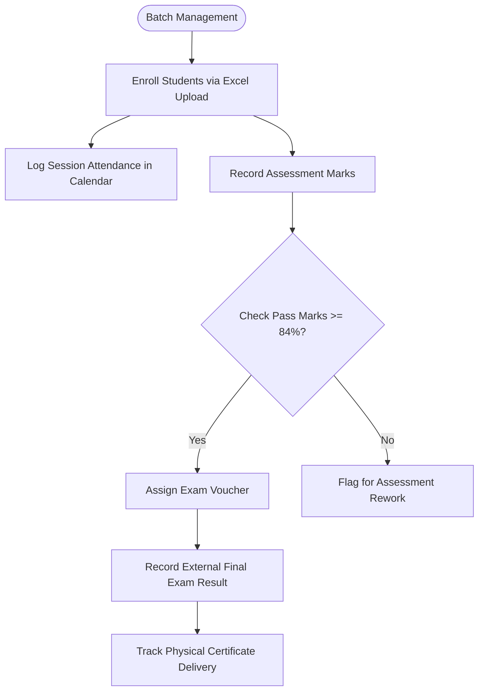
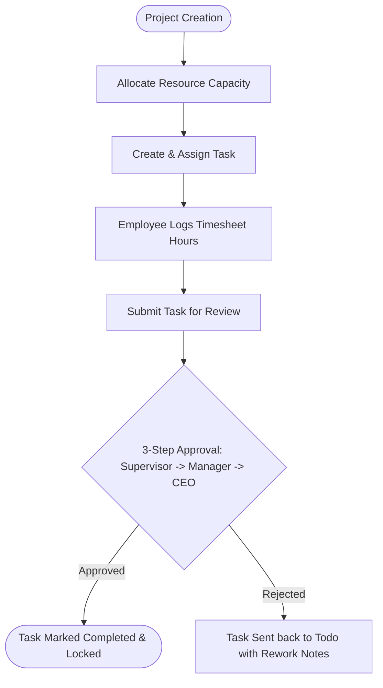
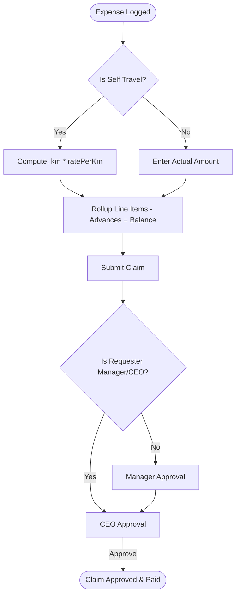

# Workflow & Module Analysis

This document describes the workflow of each module in the application, outlining their entries, inputs, business logic, database operations, outputs, dependencies, validations, and expected/unexpected outcomes.

---

## 1. Authentication Module

### Purpose
To verify user identity and authorize access by translating user identifiers (email, username, phone) into Supabase Auth emails, authenticating credentials, loading employee profiles, and initializing role-based permissions.

### Entry Point
- Route: `/login`
- File: [LoginPage.tsx](file:///Users/apple/Downloads/flow-desk-main/src/app/pages/auth/LoginPage.tsx)

### Input
- Username, Email, or Phone Number (`identifier`)
- Plaintext password (`password`)
- "Remember Me" toggle (`rememberMe`)

### Business Logic & Database Operations
1. Resolves `identifier` to a registered email address using the `resolve_login_email` database function.
2. Authenticates credentials against Supabase Auth (`supabase.auth.signInWithPassword`).
3. If authentication succeeds, loads the corresponding profile from `flwdsk_employees` using the auth user's UUID.
4. If no DB role exists, infers the role based on predefined rules (e.g., matching names/emails like "Ajay" or "Jomon" to `ADMIN`/`CEO`, or mapping designations).
5. If the inferred or resolved role differs from the one stored in `flwdsk_employees`, syncs it to the database table so RLS policies operate correctly.
6. Returns an active `Session` object consisting of user profile metadata, access token, and session expiry time.

### Outputs, Dependencies & Error Handling
- **Output**: `Session` object saved in React state, and a redirect to `/app` (MyDay).
- **Connected Modules**: All protected views (checks the session in `ProtectedRoute`).
- **Dependencies**: Supabase GoTrue Auth, `flwdsk_employees` table.
- **Validation**: Enforces non-empty strings, minimum 8 characters for password, and valid email formats.
- **Expected Result**: User is authenticated, redirect is executed, and correct role-based sidebar menus are rendered.
- **Unexpected Result**: Account is locked due to 5+ failed attempts, auth session expires (redirects to `/session-expired`), or an orphan user logs in but has no employee row (fails with a `NOT_FOUND` error).

---

## 2. Attendance & Work Sessions Module

### Purpose
To track daily employee logs (clock-in, clock-out, break-in, break-out), capture geographical locations, and enforce office-hour calculations.

### Entry Point
- Route: `/app` (MyDay)
- File: [AttendanceLogPage.tsx](file:///Users/apple/Downloads/flow-desk-main/src/modules/attendance/pages/AttendanceLogPage.tsx)

### Input
- Work Type (`Office`, `Training`, or `Marketing`)
- Clock Action (Clock In, Clock Out, Break In, Break Out)
- Geolocation Coordinates (Latitude, Longitude)
- Work Notes (Optional description)
- Batch ID (Required if Work Type = `Training`)

### Business Logic & Database Operations
1. Check if an active attendance record exists for the employee for the current date (`work_date = CURRENT_DATE`).
2. **Clock In**: Insert a row in `flwdsk_attendance_records` with status `present`, and add a new row in `flwdsk_work_sessions` recording `clock_in` timestamp, work type, and geo JSON.
3. **Break In**: Transition status to `on_break`, and create a row in `flwdsk_break_records` linking to the active work session.
4. **Break Out**: Set `end_time` in `flwdsk_break_records`, calculate break duration, and return status to `present`.
5. **Clock Out**: Update the active work session `clock_out` time, recalculate total working minutes (Work Time - Break Time), update the attendance status to `clocked_out`, and save.
6. Late tracking and break limits apply ONLY to the `Office` work type. Class/Training days bypass late flags.

### Outputs, Dependencies & Error Handling
- **Output**: Real-time status badge update, logged session database records.
- **Connected Modules**: Employee Profile, Executive Analytics (Attendance Reports).
- **Dependencies**: Browser Geolocation API, `flwdsk_attendance_records`, `flwdsk_work_sessions`, `flwdsk_break_records`.
- **Validation**: Enforces active GPS; forbids clock-in if already clocked in; checks if selected batch is valid.
- **Expected Result**: Active timers count up on MyDay dashboard; durations are calculated to the minute.
- **Unexpected Result**: Location access denied (blocks logging if location check is strictly enforced), or dangling sessions left open at midnight (handled by legacy MongoDB crons but orphaned on Supabase).

---

## 3. Training & Student Lifecycle Module

### Purpose
To manage academic entities (Colleges, Courses, Batches), student enrollment, class session scheduling, assessment scoring, and voucher assignment.

### Entry Point
- Routes: `/app/training/batches`, `/app/training/students`, `/app/training/calendar`
- Files: [BatchManagement.tsx](file:///Users/apple/Downloads/flow-desk-main/src/modules/training/pages/BatchManagement.tsx), [StudentLifecycle.tsx](file:///Users/apple/Downloads/flow-desk-main/src/modules/training/pages/StudentLifecycle.tsx)

### Input
- Student rosters (via Excel file upload or manual forms)
- Attendance marks per scheduled class session
- Assessment marks per student (score out of max marks)
- Voucher codes and statuses

### Business Logic & Database Operations
1. **Roster Upload**: Parse uploaded student sheets, insert records into `flwdsk_student_records`, and create `flwdsk_enrollments` linking them to the selected batch.
2. **Eligibility Calculation**: Check student grades. If the student scores `>= 84%` on ALL selected assessments, flag them as `eligible` for the final exam.
3. **Voucher Assignment**: Assign bulk-purchased vouchers manually to eligible students (`flwdsk_vouchers`).
4. **Certification**: Record the physical delivery status (`printed`, `deliveredToCollege`) of completion certificates against `flwdsk_certificates`.

### Outputs, Dependencies & Error Handling
- **Output**: Roster tables, calendar sessions, grades sheets, voucher lists.
- **Connected Modules**: Project Management, Executive Analytics.
- **Dependencies**: XLSX Parser (`xlsx`), `flwdsk_batches`, `flwdsk_student_records`, `flwdsk_enrollments`, `flwdsk_schedule_sessions`, `flwdsk_assessments`, `flwdsk_vouchers`.
- **Validation**: Ensures unique student emails; checks that assessment scores do not exceed the maximum allowed marks; checks date ranges for batch schedules.
- **Expected Result**: Excel upload populates the batch roster instantly; exam eligibility updates automatically when grades are entered.
- **Unexpected Result**: Excel columns mismatch (causes parsing failure), or non-UUID ids are supplied by the frontend (intercepted by `stripInvalidId` to avoid database transaction aborts).

---

## 4. Project & Resource Management Module

### Purpose
To track clients, projects, milestones, tasks, and resource allocation capacity. Enforces a 3-step supervisor approval chain for timesheets and tasks.

### Entry Point
- Routes: `/app/projects`, `/app/project/tasks`, `/app/project/timesheets`
- Files: [ProjectsAndTasks.tsx](file:///Users/apple/Downloads/flow-desk-main/src/modules/project/pages/ProjectsAndTasks.tsx), [TaskBoard.tsx](file:///Users/apple/Downloads/flow-desk-main/src/modules/project/pages/TaskBoard.tsx)

### Input
- Client details, Project settings, Milestone dates.
- Task title, description, assignee, priority, estimation hours.
- Daily Timesheet logs (hours, billable checkbox, description).

### Business Logic & Database Operations
1. **Resource Allocation**: Assign employee to project with capacity percentage and dates (`flwdsk_resource_allocations`).
2. **Task Board**: Assignee logs work sessions. When task is marked complete, it enters a 3-step approval chain: `Supervisor` -> `Manager` -> `CEO`.
3. **Timesheet Submission**: Employee submits logged hours (`flwdsk_timesheets`). Status updates to `pending`. Approver reviews and updates status to `approved` or `rejected`.

### Outputs, Dependencies & Error Handling
- **Output**: KanBan task board, resource scheduling grid, approved timesheets.
- **Connected Modules**: Attendance Module, Finance Module (Payroll Prep).
- **Dependencies**: `flwdsk_projects`, `flwdsk_tasks`, `flwdsk_timesheets`, `flwdsk_resource_allocations`.
- **Validation**: Enforces timesheet logs within project bounds; allocations cannot exceed 100% capacity; check dates.
- **Expected Result**: Timesheet hours sum up to provide project cost analysis; task statuses transition smoothly across KanBan lanes.
- **Unexpected Result**: Employee logs time on a deleted task or project, or RLS policies reject updates due to expired authentication tokens.

---

## 5. Finance & Operations Module

### Purpose
To manage employee travel requests, budgets, procurement, vendors, assets, and expense claims. Enables derived-km cost calculations for travel expenses.

### Entry Point
- Route: `/app/finance/expenses`
- File: [ExpenseClaims.tsx](file:///Users/apple/Downloads/flow-desk-main/src/modules/finance/pages/ExpenseClaims.tsx)

### Input
- Expense category (`Self Travel`, `Lunch`, etc.)
- Amount (or derived details: vehicle mode, distance in km)
- Advancements received, Receipt attachments.

### Business Logic & Database Operations
1. **Derived Travel Expenses**: If category is `Self Travel`, amount is not input directly. It is computed as `km * ratePerKm[mode]` (Bike: 5 INR/km, Car: 10 INR/km).
2. **Advances & Rollover**: Total claim is computed. Outstanding balance is calculated as `Total Amount - Advances`.
3. **Approval Chain**: Claims are routed through `Reporting Manager` -> `CEO`. If the requester is already in the chain (e.g. a Manager claiming expenses), that step is automatically skipped, and approval escalates directly to the CEO.

### Outputs, Dependencies & Error Handling
- **Output**: Expense reports, receipts storage, budget deductions.
- **Connected Modules**: Employee Profile, Executive Analytics (Expense Reports).
- **Dependencies**: Cloudinary (or Supabase Storage) for receipts, `flwdsk_expense_claims`, `flwdsk_travel_requests`, `flwdsk_expense_types`.
- **Validation**: Enforces receipt attachments for `Medical Leave` or travel types; validates budgets before PO generation.
- **Expected Result**: Travel mileage is computed automatically; managers approve logs, updating finance ledgers.
- **Unexpected Result**: Missing or uninitialized expense types in the database cause inserts to fail (partially resolved by repository fallback loops but leads to warnings).
