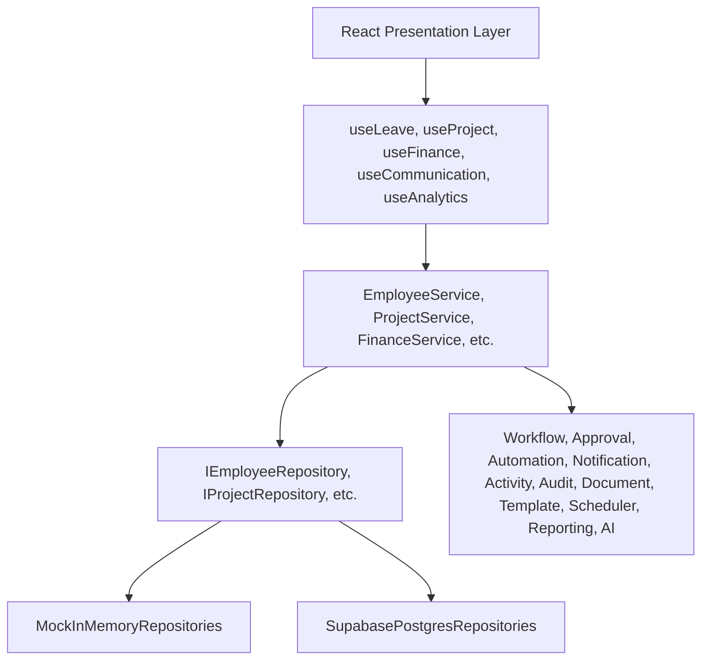

# KVJ Analytics ERP Modernization — Production Documentation

This document serves as the central system architecture reference, developer guide, administrator guide, and deployment manual for the modernized KVJ Analytics ERP.

---

## 1. System Architecture

The ERP is designed using **Clean Architecture** patterns. By separating concerns into distinct layers, we ensure that changes to database providers (e.g. Supabase) or UI frameworks do not affect core business rules.



### Decoupled Core Platform Engines
- **Workflow Engine**: Manages transition states (e.g. `leave-request`, `expense-approval`).
- **Approval Engine**: Sequential/parallel multi-stage reviews.
- **Automation Engine**: Cron-like background ticks and rule validations.
- **Notification Engine**: Channels dispatch router.
- **Activity Engine**: Aggregates telemetry updates.
- **Audit Engine**: Tracks revisions delta changes.
- **Document Engine**: Google Drive storage manager.
- **Template Engine**: Formulates HTML and PDF layouts.
- **Scheduler Engine**: Cron schedules manager.
- **Reporting Engine**: CSV/Power BI schema exports.
- **AI Ready Interface**: Natural language summary generator.

---

## 2. Developer Guide

### Getting Started
1. **Clone & Install Dependencies**:
   ```bash
   npm install
   ```
2. **Launch Dev Server**:
   ```bash
   npm run dev
   ```
3. **Verify Types**:
   ```bash
   npm run typecheck
   ```
4. **Compile Production Bundle**:
   ```bash
   npm run build
   ```

### Registering New Modules & Repositories
1. Define repository interface contracts and tokens in the module's `*.repository.ts` file.
2. Build mock implementations in `mock-*.repository.ts` and Supabase implementations in `supabase-*.repository.ts`.
3. Register bindings in the central DI container inside `src/app/bootstrap.ts` checking the configuration of `featureFlags.integrations.supabase`.

---

## 3. Administrator & Deployment Guide

### Configuration Variables (.env)
- `VITE_SUPABASE_URL`: Supabase endpoint URL.
- `VITE_SUPABASE_ANON_KEY`: Supabase Client Anonymous API key.

### Docker Deployment
Start the entire service stack locally inside container environments:
```bash
docker-compose up --build -d
```

### Backup & Restoration Strategy
All structured entity tables are backed by Postgres databases:
1. **Database Backups**:
   Generate an SQL dump file of the tables:
   ```bash
   pg_dump -U postgres -h db.supabase.co -d postgres > backup.sql
   ```
2. **Restoration**:
   ```bash
   psql -U postgres -h db.supabase.co -d postgres < backup.sql
   ```
