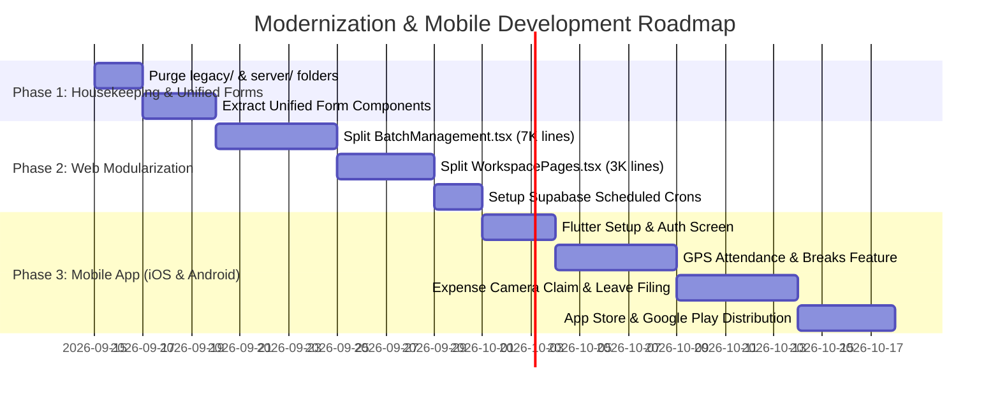

# KVJ Analytics ERP — Executive Audit Report & Mobile Roadmap

> **Target Audience:** Executive leadership & decision-makers. Written in plain English with simple analogies.  
> **Accompanying Document:** A PDF presentation has been generated at: [`KVJ_Analytics_ERP_Audit_and_Mobile_Roadmap.pdf`](file:///Users/apple/Downloads/flow-desk-main/KVJ_Analytics_ERP_Audit_and_Mobile_Roadmap.pdf)

---

## 1. Executive Summary

KVJ Analytics ERP is an operational platform powering daily operations across **Employee Attendance, Leave Tracking, Training Batches, Exam Vouchers, Expense Claims, Project Tasks, and Communication**.

Over time, rapid feature additions have created four critical challenges:
1. **Duplicated Forms:** The same action (e.g., *Creating a Task* or *Applying for Leave*) has 2 to 4 different forms coded in separate screens with conflicting validation rules.
2. **"Monster" Files:** Four single files contain 2,000 to 7,000 lines of code. This causes rendering lag and makes code edits risky.
3. **Ghost Code & Digital Clutter:** The repository contains an old, disconnected Express backend (`server/`), retired React code (`legacy/`), and 25 one-off test scripts (`sandbox-scripts/`).
4. **Mobile Gap:** The platform is currently desktop-only. Field trainers and employees need an intuitive iOS & Android app for GPS clock-ins, receipt photo uploads, and classroom attendance.

---

## 2. Form Component Unification (Single Source of Truth)

### The Core Problem
When an employee creates a task from **"My Day"**, the system uses one piece of code. When creating a task from the **"Task Board"**, it uses another. When creating it inside a **"Project View"**, it uses a third.
* **Risk:** In one screen, assigning a project was mandatory; in another, it was optional. Task deadline formats differed. If you want to add a field like "Priority" or "Estimated Hours," developers have to modify 3 or 4 files separately.

### Unified Component Architecture

| Business Entity | Where Duplicated in Code | Discrepancy / Risk | Unified Component Solution |
| :--- | :--- | :--- | :--- |
| **Chat & Direct Message Alerts** | • `useCommunication.ts` (Scoped only to open channel)<br>• `NotificationProvider.tsx` (No chat connection) | **Resolved Today:** Staff previously received zero audio chime or banner when incoming messages arrived; users missed urgent task/project communication unless actively viewing the chat window. | **Real-Time Sound Chime & Toast:** Added global Supabase Realtime listener, harmonic dual-tone chime (E5 &rarr; B5), and instant top-right Toast alert with sender name. |
| **Attendance Corrections** | • `AttendanceHistory.tsx` (Correction Claim)<br>• `ApprovalsQueue.tsx` (Force Clock-Out)<br>• `AttendanceLogPage.tsx` (Session Claim) | **Resolved Today:** Timezone offset bug (+5:30 shift) resolved today. Forms now use universal UTC ISO conversion. | Standardize into **`AttendanceCorrectionModal.tsx`** and **`ForceClockOutModal.tsx`**. |
| **Batch PDF Reports (180+ Rows Defect)** | • `DailyReportDocument.tsx`<br>• `StudentDataSection.tsx`<br>• `BatchManagement.tsx` (Direct Export) | **Resolved Today:** 180-student batches collapsed onto a single 4,000px mega-page without proper pagination. Missing top margins on continuation pages caused text clipping. | **Discrete A4 Chunk Paginator:** Sliced into 16-row blocks with repeated table headers, explicit 22mm top margins, and running headers on every page. |
| **Task Creation Form** | • `WorkspacePages.tsx` (My Day)<br>• `TaskBoard.tsx` (Kanban Board)<br>• `ProjectList.tsx` (Project View)<br>• `CreateTaskModal.tsx` | Validation rules and fields differ; project selection requirement inconsistent across views. | Extract **`TaskFormModal.tsx`** into `src/modules/project/components/`. Used identically everywhere with optional prefill props. |
| **Leave Application Form** | • `WorkspacePages.tsx` (My Day Quick Action)<br>• `LeaveBoard.tsx` (Dedicated Leave Screen) | My Day quick drawer lacked medical certificate upload and half-day shift selectors present in LeaveBoard. | Extract **`ApplyLeaveModal.tsx`** into `src/modules/leave/components/` as the single authoritative leave filing form. |
| **Expense Claim Filing** | • `ExpenseClaims.tsx` (Inline Drawer)<br>• `AttendanceLogPage.tsx` (Inline Claim Action) | Mileage calculation and vehicle selection logic was coded directly into raw page files. | Extract **`ExpenseClaimModal.tsx`** into `src/modules/finance/components/` with dynamic central rate calculator. |
| **Student Registration** | • `BatchManagement.tsx` (Single Student)<br>• `BatchManagement.tsx` (Bulk Import) | In-page state handling contributes to the file ballooning to 7,059 lines. | Extract **`StudentRegistrationModal.tsx`** as a dedicated standalone component. |

---

## 3. Standardized Folder Architecture Plan

### Current Structural Flaws
- **Massive Monoliths:** `BatchManagement.tsx` (7,059 lines) and `WorkspacePages.tsx` (3,231 lines) combine 5+ distinct screens into single files.
- **Ghost Directories:** `legacy/`, `server/`, and `sandbox-scripts/` remain from retired systems.
- **Empty Directories:** `src/pages/` is completely empty while screens are scattered between `src/app/pages/` and `src/modules/`.

### Proposed Modular Architecture
```
src/
├── app/                        # Application shell, global navigation, authentication providers
├── core/                       # Core Dependency Injection container, base types, shared event bus
├── shared/                     # Universal UI primitives (Button, Card, Modal, Input, Table, Date Utils)
└── modules/
    ├── project/                # Self-contained Project & Tasks domain
    │   ├── api/                # ProjectService & Supabase database calls
    │   ├── components/         # KanbanBoard.tsx, TaskCard.tsx, WorklogTable.tsx
    │   ├── forms/              # ⭐️ TaskFormModal.tsx (Shared by My Day, Task Board & Project List)
    │   ├── hooks/              # useProject.ts, useTasks.ts
    │   └── pages/              # TaskBoardPage.tsx, ProjectListPage.tsx
    ├── leave/                  # Self-contained Leave domain
    │   ├── forms/              # ⭐️ ApplyLeaveModal.tsx (Single form used everywhere for leave filing)
    │   └── pages/              # LeaveBoardPage.tsx
    ├── finance/                # Expenses, travel claims, mileage rates
    │   ├── forms/              # ⭐️ ExpenseClaimModal.tsx (Single form with central KM reimbursement calculator)
    │   └── pages/              # ExpenseClaimsPage.tsx
    └── training/               # Batches, attendance matrix, exam vouchers, certificates
        ├── components/         # StudentsTab.tsx, AttendanceMatrixTab.tsx, ExamScoresTab.tsx, DeliveryTab.tsx
        └── pages/              # BatchManagementPage.tsx (Reduced from 7,059 to < 350 lines)
```

---

## 4. Housekeeping: Dead Files to Purge

| Directory / File | What It Contains | Why It Is Safe to Delete |
| :--- | :--- | :--- |
| `legacy/` (entire folder) | Old React JavaScript frontend | Completely disconnected. Modern app runs on TypeScript in `src/`. |
| `server/` (entire folder) | Old Express.js & MongoDB backend | Unused. Active app connects directly to Supabase cloud database. |
| `sandbox-scripts/` (25 files) | Old scratch test files (`scratch1..7.js`) | One-off developer tests from months ago. Not part of runtime app. |
| `src/pages/` | Empty directory | Zero files inside. Real pages are in `src/modules/`. |

---

## 5. Business Logic Catalog (Rules Currently Applied in Code)

*Please review these rules. If any rule does not match your company policy, we can adjust it immediately:*

| Module Area | Current Rule in Software | Exact Formula / Time Cut-off | Status |
| :--- | :--- | :--- | :--- |
| **Attendance Shift** | Expected office shift: 09:30 AM to 05:30 PM (17:30). | Clock-in at **09:31 AM or later** flagged Late.<br>Clock-out before **05:30 PM** flagged Early Exit. | Standard |
| **Net Working Time** | Breaks deducted from gross duration. | $\text{Net Hours} = (\text{Clock Out} - \text{Clock In}) - \text{Total Breaks}$ | Accurate |
| **Force Clock-Out** | Admin force-closes unclosed sessions from yesterday. | Defaults to **05:30 PM** (now saved with proper UTC conversion). | Fixed Today |
| **Leave Quota** | Financial Year: April 1 to March 31. Accrues monthly. | $\text{Allocated Leaves} = 1.0\text{ day/month} \times \text{Months Elapsed since April 1st}$ | 1.0 Day / Mo |
| **Leave Cancellation** | Strict employee self-cancellation deadlines: | • Morning / Full-day: before **10:30 AM**.<br>• Evening Half-day: before **03:00 PM**.<br>• Past days cannot be self-cancelled. | Verify Policy |
| **Travel Mileage** | Mileage reimbursement auto-calculated by vehicle: | • **Two-Wheeler (Bike):** ₹ 5.00 / km<br>• **Four-Wheeler (Car):** ₹ 12.00 / km<br>$\text{Amount} = \text{Distance (KM)} \times \text{Vehicle Rate}$ | Configurable |
| **Chat Sound Alerts** | Audible chime & toast alerts for recipients; self-sent messages and muted channels are silenced. | $\text{Chime Triggered} \iff \text{Sender} \ne \text{Current User} \land \text{Channel} \ne \text{Muted}$ Dual-tone audio chime (E5 &rarr; B5) + popup banner across all pages. | Live & Active |
| **Exam Eligibility** | Attendance threshold + passing internal mark. | Voucher unlocks only if student achieves threshold (75% or 80% attendance). | Standard |
| **Exam Retests** | Retest scores locked until payment verified. | Admin must verify `Retest Payment = Verified` before mark input unlocks. | Audit Protected |
| **Batch Report Pagination** | Multi-page roster splitting, repeating headers & A4 print margins. | • **16 rows/page** (HTML) or **30-32 rows/page** (vector PDF).<br>• Table header repeated on every continuation page.<br>• Top margin **&ge; 22mm** protects running headers. | Optimized Today |

### Enterprise Suggestions for PDF Report Generation:
1. **Vector PDF Over Browser Printing:** Always recommend the direct "Download PDF" (Vector PDF via jsPDF) rather than browser `window.print()`. Vector PDFs produce crisp, selectable text with exact millimetre coordinates, completely immune to operating system print drivers or screen zoom scaling.
2. **Discrete 16-Row Booklet Chunking:** In HTML print views, never render 180+ rows inside a single monolithic block with `page-break-inside: avoid`. Slice data into discrete 16-row chunks where each chunk carries its own repeating table `<thead>` and caption badge.
3. **Typography & Data Density (8.5pt Font):** For dense 9-column student registers, standardize on 8.5pt font with 2mm cell padding. This fits 30-32 student rows per page cleanly, turning a 14-page messy document into a tight, professional 6-page report.
4. **Continuation Page Geometry:** Every continuation page must reserve explicit top margin (`margin.top: 22mm`) so table rows do not collide with running headers ("KVJ Analytics | Batch Name | Page X of Y").

---

## 6. Mobile Application Strategy (iOS & Android)

### Recommended Technology: **Flutter (Dart)**
* **High Performance:** Smooth 60/120 FPS native app for both iPhones and Android devices.
* **Shared Cloud Backend:** Connects directly to your **existing Supabase database**. When a field trainer clocks in or files a claim on mobile, the Admin Web dashboard updates instantly.

### Feature Division (Mobile vs Web):
* **On Mobile (Field & Trainer App):**
  1. **1-Tap GPS Attendance:** Geofencing verifies the employee is physically at the office or college before clocking in.
  2. **Camera Expense Claims:** Snap photos of petrol slips; auto-calculates KM reimbursement.
  3. **Classroom Attendance Roster:** Fast swipe-to-mark Present/Absent for students.
  4. **Push Notifications:** Shift reminders (9:25 AM & 5:30 PM) and approval alerts.
* **On Web App (Desktop Management):**
  1. Multi-page PDF Training Batch Report generation.
  2. Full Admin Control Panel & user provisioning.
  3. Broad Gantt scheduling matrix.

---

## 7. Action Roadmap


