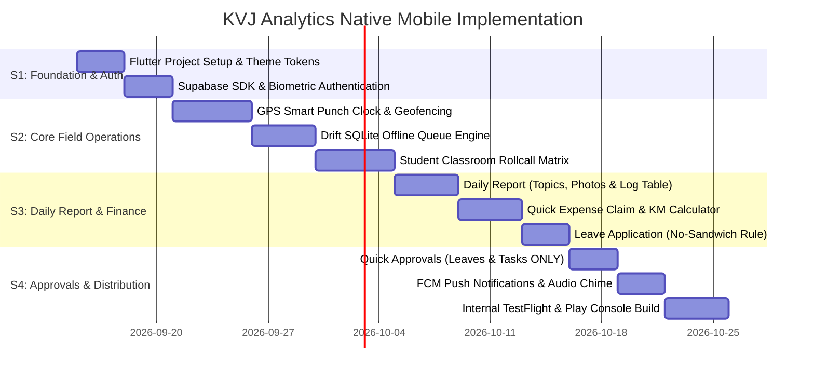

# KVJ Analytics — Native Mobile Application Architecture & Implementation Roadmap
**Target Platforms:** iOS & Android (Cross-Platform Native via Flutter)  
**Backend:** Supabase Cloud (PostgreSQL)  
**Version:** 1.0.0 (Production Roadmap)  
**Status:** Approved Specification  

---

## 1. Executive Summary & Mobile Strategy

The KVJ Analytics Enterprise Mobile Application is engineered to empower field operations—specifically **Trainers, Field Marketing Representatives, and Management Executives**—with a high-speed, offline-first mobile companion.

### Core Strategic Mandate
1. **Identical Business Logic & Parity:** Every calculation (e.g., *Self Travel KM $\times$ Vehicle Rate*, *No-Sandwich Leave Deductions*, *Batch Minimum Attendance Thresholds*, and *Cumulative Delivery Hours*) must execute identically on Mobile and Web.
2. **Lean Mobile Scope:** The mobile application intentionally avoids complex desktop workflows. Heavy administrative audits (Attendance Corrections, Expense Audit Queues, Multi-Page Vector PDF Generation, Employee Provisioning) are strictly gated to Desktop browsers.
3. **Field Durability (Offline First):** Trainers and field reps frequently operate in basement computer labs or remote college campuses with intermittent cellular coverage. All daily punches, student rosters, and expense drafts are persisted locally in SQLite before background synchronization.

---

## 2. Technology Stack & Dependencies

```
┌────────────────────────────────────────────────────────────────────────┐
│                        Flutter UI (Dart 3.x)                           │
│     Material 3 Theme · Custom KVJ Design Tokens · Haptic Feedback      │
├──────────────────────────────────┬─────────────────────────────────────┤
│   State Management & Logic       │      Local Storage & Offline Engine │
│   Riverpod 2.x (Code-Gen)        │      Drift (SQLite) + Hive Caching  │
├──────────────────────────────────┴─────────────────────────────────────┤
│                         Hardware Services                              │
│   Geolocator · Camera / Image Cropper · Local Auth (Biometrics) · FCM   │
├────────────────────────────────────────────────────────────────────────┤
│                       Backend Communication                            │
│           supabase_flutter 2.x (PostgreSQL RPC + Realtime)             │
└────────────────────────────────────────────────────────────────────────┘
```

### Dependency Manifest (`pubspec.yaml` Specifications)

| Package | Version | Architectural Purpose |
| :--- | :--- | :--- |
| `supabase_flutter` | `^2.5.0` | Direct Supabase Auth, PostgreSQL DB queries, Realtime subscriptions, and Storage. |
| `flutter_riverpod` | `^2.5.0` | Reactive state management, dependency injection, and auto-dispose providers. |
| `riverpod_annotation`| `^2.3.0` | Clean code-generation for type-safe state notifiers and asynchronous family providers. |
| `drift` | `^2.16.0` | Type-safe reactive SQLite ORM for offline punch and roster queues. |
| `geolocator` | `^11.0.0` | High-accuracy GPS positioning with hardware mock-location detection. |
| `image_picker` | `^1.1.0` | Camera capture for student classroom verification & receipt invoices. |
| `flutter_image_compress`| `^2.2.0`| Client-side JPEG/WebP compression (down to $\le$ 400KB) before cloud upload. |
| `local_auth` | `^2.2.0` | Biometric FaceID / Fingerprint quick unlocking. |
| `firebase_messaging` | `^14.8.0`| Remote push notifications (09:25 AM shift reminder, 17:30 clock-out alert, leave outcomes). |
| `flutter_local_notifications`| `^17.1.0`| Local scheduled notifications and foreground push alert banners. |
| `go_router` | `^13.2.0` | Declarative routing with deep-linking support and bottom-navigation persistence. |

---

## 3. Lean Mobile Scope vs. Desktop Gating Matrix

In strict alignment with corporate policy, the mobile app strictly scopes down administrative sprawl:

| Feature Area | Mobile App Capability (iOS / Android) | Desktop / Laptop Capability (Web) | Gating Mechanism |
| :--- | :--- | :--- | :--- |
| **GPS Clock-In / Out** | ✅ **1-Tap GPS Punch** with work type classification & batch linking. | ✅ Web punch log with map viewer. | Standard |
| **Classroom Rollcall** | ✅ **Swipe-to-mark Student Roster** with live % attendance counter. | ✅ Multi-date attendance session matrix. | Standard |
| **Daily Report Filing** | ✅ **Topics Covered + 2 Photos + Delivery Hours Preview**. | ✅ Full report builder, layout customization, and Vector PDF generator. | Desktop Only for PDF |
| **Expense Claims** | ✅ **Quick Claim Submission** (Self-Travel KM auto-calc; receipt optional). | ✅ Full claim submission + receipts manager. | Standard |
| **Expense Audits** | ❌ **Hidden on Mobile**. | ✅ Multi-claim bulk approve/reject, rate editor, Excel export. | `DesktopOnlyNotice` |
| **Leave Filing** | ✅ **Casual / Medical Leave** with Shift & No-Sandwich auto-calc. | ✅ Full leave management dashboard. | Standard |
| **Approvals Queue** | ✅ **Leaves & Peer Tasks ONLY** (Quick 1-tap accept/reject). | ✅ Full Approvals: Leaves, Tasks, Attendance Corrections & Unclosed Sessions. | Gated on Mobile |
| **Attendance Corrections**| ❌ **Hidden on Mobile** (Cannot file or approve). | ✅ Full multi-session split claim and admin approval queue. | `DesktopOnlyNotice` |
| **Employee Provisioning**| ❌ **Hidden on Mobile**. | ✅ Create/edit employee, auto-ID generation, deactivate logins. | Desktop Only |

---

## 4. Mobile Architecture & Code Structure

The Flutter application follows **Feature-First Clean Architecture**:

```
kvj_mobile/
├── android/
├── ios/
├── assets/
│   ├── icons/
│   └── sounds/                 # e5_b5_chime.wav
└── lib/
    ├── app/
    │   ├── app.dart            # MaterialApp.router, theme configuration
    │   └── router.dart         # GoRouter with bottom navigation shell
    ├── core/
    │   ├── constants/          # API keys, table names, central travel rates
    │   ├── database/           # Drift SQLite database (local_db.dart)
    │   ├── errors/             # AppFailure & Result<T> functional types
    │   ├── network/            # Supabase client wrapper & connectivity checker
    │   ├── services/           # GeolocationService, BiometricService, NotificationService
    │   └── utils/              # DateUtils, Indian currency formatter
    ├── features/
    │   ├── attendance/         # Punch clock, breaks, GPS geofencing
    │   │   ├── data/           # AttendanceRepository & Drift local sync
    │   │   ├── domain/         # WorkSession, AttendanceRecord models
    │   │   ├── presentation/   # AttendanceScreen, ClockInModal, ShiftSummaryCard
    │   │   └── providers/      # attendance_notifier.dart
    │   ├── training/           # Classroom roster, student rollcall, daily report
    │   │   ├── data/           # TrainingRepository, DeliveryLogsRepository
    │   │   ├── domain/         # Batch, Student, DeliveryLogItem models
    │   │   ├── presentation/   # BatchesScreen, StudentRollcallScreen, SubmitDailyReportScreen
    │   │   └── providers/      # batch_detail_notifier.dart, roster_notifier.dart
    │   ├── expense/            # Mileage calculator, quick claim filing
    │   │   ├── data/           # ExpenseRepository
    │   │   ├── domain/         # ExpenseClaim model
    │   │   ├── presentation/   # ExpenseListScreen, QuickExpenseModal
    │   │   └── providers/      # expense_notifier.dart
    │   ├── leave/              # Leave application, shift selector, balance cards
    │   │   ├── data/           # LeaveRepository
    │   │   ├── domain/         # LeaveRequest, LeaveBalance models
    │   │   ├── presentation/   # LeaveScreen, ApplyLeaveModal
    │   │   └── providers/      # leave_notifier.dart
    │   ├── task/               # My Tasks list, timer, peer approvals
    │   │   ├── presentation/   # TasksScreen, TaskTimerWidget
    │   │   └── providers/      # task_notifier.dart
    │   └── approvals/          # Mobile Quick Approvals (Leaves & Tasks ONLY)
    │       ├── presentation/   # QuickApprovalsScreen
    │       └── providers/      # quick_approvals_notifier.dart
    └── shared/
        ├── theme/              # KVJ Palette (Indigo #4338ca, Slate #0f172a)
        └── widgets/            # KVJButton, KVJCard, DesktopRestrictedModal, BottomNavBar
```

---

## 5. Detailed Mobile Feature Specifications

### 5.1 Feature 1: GPS Smart Punch Clock

```
[ GPS Coordinates Check ] ──> Lat/Long within 250m of Office/College?
                                  ├── YES ──> [ Allow Punch ] ──> [ Write SQLite ] ──> [ Sync Supabase ]
                                  └── NO  ──> [ Flag Remote ] ──> [ Require Notes ] ──> [ Sync Supabase ]
```

- **Classification Selector:**
  - `Office` (Default)
  - `Training` (Requires selecting active Batch from dynamic dropdown)
  - `Marketing` (Requires Organization Visited field)
  - `Work From Home`
- **Geofence Verification:**
  - Standard Office Radius: 250 meters from Office coordinates.
  - College Campus Radius: 500 meters from assigned batch campus coordinates.
  - If trainer is outside perimeter, punch is accepted with `out_of_fence: true` flag and mandatory notes.
- **Break Tracker:**
  - 1-tap "Start Break" & "Resume Work".
  - Gross duration minus break time calculates `net_working_hours` in real time on the UI.

### 5.2 Feature 2: Classroom Student Attendance Rollcall

- **Interface:** Horizontal student cards with photo thumbnail, register number, and full name.
- **Gesture Control:**
  - Swipe Right &rarr; Mark Present (Green)
  - Swipe Left &rarr; Mark Absent (Red)
  - Tap card &rarr; Detailed notes / tardiness flag.
- **Header Actions:**
  - "Mark All Present" fast button for 60+ student classrooms.
  - Live attendance metric badge: `48 / 50 Present (96%)`.
- **Database Target:** Direct upsert into `flwdsk_schedule_sessions` linked to `student_id`, `batch_id`, and `date`.

### 5.3 Feature 3: Submit Daily Batch Report

- **Input Fields:**
  - Topics Covered (Text input)
  - Practical Exercises Conducted (Toggle Switch)
  - Session Summary Notes (Multi-line text)
  - 2 Classroom Photographs (Camera capture with instant WebP compression $\le$ 300KB)
- **Cumulative Delivery Log Table Preview:**
  - Before final submission, the mobile app calls `getBatchTrainingDeliveryLogs(batchId, today)` and renders a native table showing:
    - `Day #`
    - `Date`
    - `Trainer Name`
    - `Start Time`
    - `End Time`
    - `Duration` (e.g. `6h 00m`)
  - Ensures trainers verify that yesterday's session and all past days are logged accurately before submitting today's report.

### 5.4 Feature 4: Quick Expense Claim

- **Category:** `Office Expense` vs `Training Expense` (links to batch).
- **Self Travel Auto-Calculator:**
  - When Expense Type = `Self Travel`:
    - Vehicle Selector: `Two-Wheeler (Bike)` or `Four-Wheeler (Car)`.
    - Kilometers Input (Numeric).
    - Formula: $\text{Reimbursement} = \text{KM} \times (\text{Bike ₹5.00} \text{ or } \text{Car ₹12.00})$.
    - Receipt upload is **explicitly optional** for self-travel.
- **General Claims:**
  - Expense Type dropdown (Morning Tea, Lunch, Stationery, Lab Supplies).
  - Amount input.
  - Receipt upload via camera (Optional).
- **Past Date Filing:** Allowed unconditionally without restriction.

### 5.5 Feature 5: Leave Application (No-Sandwich Rule)

- **Leave Types:** `Casual Leave` and `Medical Leave` only (Earned leave removed).
- **Shift Selection:** `Full Day`, `Morning Half Day`, `Afternoon Half Day`.
- **No-Sandwich Business Logic Engine:**
  - When calculating leave duration between `startDate` and `endDate`:
    - System iterates through calendar days.
    - Saturdays and Sundays are strictly **zero (0.0) deduction**.
    - Declared public holidays are strictly **zero (0.0) deduction**.
    - Example: Leave from Friday to Monday = **2.0 days deduction** (Friday + Monday), NOT 4 days.

### 5.6 Feature 6: Mobile Quick Approvals (Managers & CEO)

- **Dedicated Mobile Queue:**
  - **Leave Applications:** Employee name, leave type, date range, working days deducted, and reason. Two touch targets: `[✓ Approve]` and `[✕ Reject]`.
  - **Peer Tasks:** Review task deliverables and approve completion.
- **Strictly Gated Off Mobile:**
  - When tapping on Attendance Corrections or Expense Audits on mobile, display `DesktopRestrictedModal`:
    > *"💻 Desktop Audit Required: Attendance correction approvals and expense claim financial audits involve multi-session timesheet comparisons and receipt inspection optimized for desktop screens."*

---

## 6. Offline Data Synchronization (Drift + Supabase)

```
[ Trainer Action ] ──> [ Write Drift SQLite (is_synced = false) ] ──> [ Instant UI Feedback ]
                                  │
                          (Background Sync Worker)
                                  │
                   Internet Active? ──YES──> [ Upsert Supabase DB ]
                                  │               └── [ is_synced = true ]
                                  NO
                                  └──> [ Retain in SQLite, Retry on Resume ]
```

### Sync Priority Queue:
1. **Priority 1 (Critical):** Clock-in / Clock-out punches and break events.
2. **Priority 2 (High):** Student classroom rollcall records.
3. **Priority 3 (Standard):** Daily reports & expense claims (including photo upload queue).

---

## 7. Push Notifications & Realtime Alerts

1. **Shift Clock-In Reminder:** Triggered at `09:25 AM` locally on the device if no active clock-in is registered for the day.
2. **Evening Clock-Out Reminder:** Triggered at `05:30 PM (17:30)` if the employee has an open unclosed session.
3. **Approval Alerts:** Instant FCM push notification when an employee's leave or expense claim is approved/rejected.
4. **Chat & Direct Message Chime:** Global Supabase Realtime channel listener playing the KVJ audio harmonic chime (`E5 -> B5`) and presenting a high-priority heads-up notification.

---

## 8. Development Phases & Implementation Timeline



---

## 9. Conclusion & Parity Guarantee

With the implementation of this mobile architecture:
1. Field trainers execute their daily responsibilities (GPS Clock-In, Classroom Rollcall, Daily Reports with Delivery Logs) in under **60 seconds per day**.
2. Management retains tight financial and compliance control by auditing complex attendance corrections and expense invoices exclusively on high-resolution desktop viewports.
3. Data consistency is mathematically guaranteed through direct Supabase schema parity with zero middleware discrepancies.
